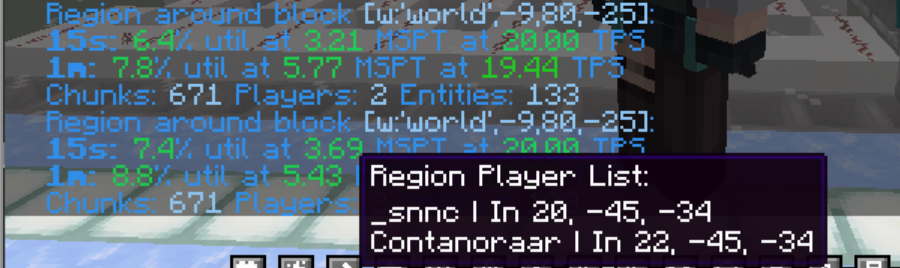

# Patch From List
Patches held upstream are not listed here. 

If you want to check what patches we have upstream, you can check it out at [Luminol](https://github.com/LuminolMC/Luminol/tree/ver/1.20.4/patches).

## Server
### Classic Bukkit
- https://github.com/SparklyPower/SparklyPaper
- https://github.com/DivineMC/DivineMC
- https://github.com/pufferfish-gg/Pufferfish
- https://github.com/Cryptite/Slice
- https://github.com/The-Fafnir/Beef
- https://github.com/LeavesMC/Leaves
- https://github.com/Winds-Studio/Leaf
- https://github.com/PlazmaMC/PlazmaBukkit

### Folia Bukkit
- https://github.com/Edenor-Minecraft/Foldenor
- https://github.com/LuminolMC/Luminol

## Mods
- https://modrinth.com/mod/lithium
- https://github.com/fxmorin/carpet-fixes

# LevelBukkit
## Features
- Experimental: Disable respawn ceiling
- Experimental: Show which zone has which players in tps command (only region), like

# Other
## Features
- Allow soil to moisten from water directly under it

## Optimization
- Cache world generator sea level
- Cache coordinate key used for nearby players when ticking chunks
- Elytra check Optimise, and hand swing Optimize
- Faster sequencing of futures for chunk structure gen
- HashedList Optimize
- Improve map-saving performance
- Lobotomize stuck villagers (off by default)
- Optimize CraftServer.getWorld(UUID)
- Optimize state lookup more
- Raid AI Optimize
- Random flatten triangular distribution
- RecipeManager Optimize
- Reduce array allocations
- Reduce sensor work
- SIMD utilities
- Skip "distanceToSqr" call in "ServerEntity#sendChanges" if the delta movement hasn't changed
- Skip dirty stats copy when requesting player stats
- Placing locked hopper no longer send NC updates
- getBiome Optimize

## Security
- Safe seed support (off by default)

## Vanilla
- Vanilla hopper support (off by default)
- Vanilla end teleportation behavior

## Fix
- Fix MC-98160 and MC-105103
- Fix MC-93826
- Fix MC-110386
- Fix MC-172801
- Fix concurrency issues when using "imageToBytes" in multiple threads
- Fix 'outdated server' showing in ping before server fully boots
