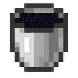

    
      
    
    
    
    
      
    
"Always live for yourself", for personal learning to use high performance <a href="https://github.com/PaperMC/Folia">Folia</a>/<a href="https://github.com/LuminolMC/Luminol/blob/ver/1.20.6/README_EN.md">Luminol</a> Fork.

All of my other projects are going away, and I'm no longer playing Minecraft, but LevelBukkit will continue to exist until I get tired of it.

👉 [Patch List](PATCH-LIST.md)

👉 [Wiki](https://github.com/LevelTranic/LevelBukkit/wiki)
