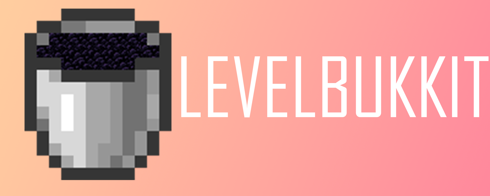

    
    <h2>LevelBukkit 1.20.6</h2>
      
    
    
    
    
      

----
> Now mainly maintain Vine Server, there is no time to add changes to LevelBukkit.

    <h2>Download</h2>
    
<a target="_blank" href="https://tranic.one/downloads/levelbukkit">Click To Download</a>

    <h2>Features</h2>
    <li>Lobotomize stuck villagers</li>
    <li>Implement Secure Seed</li>
    <li>Optional vanilla implementation</li>
    <li>Optional performance optimizations</li>
    <li>And more....</li>

    <h2>Tranic Server</h2>
    
    &nbsp;&nbsp;&nbsp;&nbsp;&nbsp;&nbsp;
    
      

    <h2>Contact Us</h2>
    
Our Discord server is still under construction and I don't have that much time to maintain it all. For now, I recommend filing issues on Github as much as possible.

